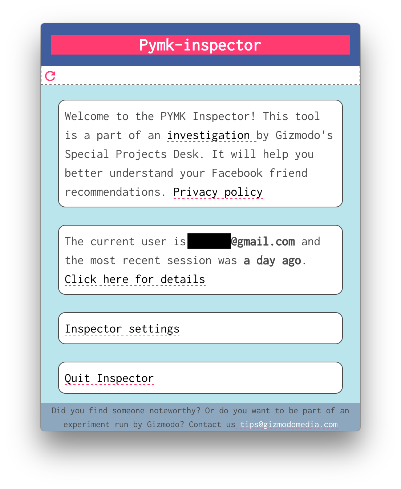

  

> See the people Facebook thinks you know


## What is the pymk-inspector?

The pymk-inspector is a tool built by Gizmodo's Special Projects Desk that we used for our [investigation](https://gizmodo.com/tag/people-you-may-know) into Facebook's people you may know (pymk) algorithm. We have used a version of this tool internally for a while to better understand how Facebook suggests friends to us. For more information you can read [this post]().



## Are you collecting any data from this?

No, all the data is stored locally and the app itself never reads any user credentials.  We are making the code open source so others can verify this. Our motivation for building this tool is to allow our readers to get a better understanding of how Facebook suggests friends to them over time. If you have something to share or want to help us with our investigations get in touch with us at `tips@gizmodomedia.com`


## What Operating Systems does this run on? 

Currently it only runs on OSX. In theory it should work on Windows and Linux but we have not had the time to test it on those platforms so we are only releasing an OS X build. If you want to try to use it on other platforms you should be able to clone this repository and do so!


## Want to build it from source?
This app was built using [electron](https://electronjs.org/) and [electron-vue](https://github.com/SimulatedGREG/electron-vue)
``` bash
# install dependencies
npm install

# serve with hot reload at localhost:9080
npm run dev

# build electron application for production
npm run build

```

---
